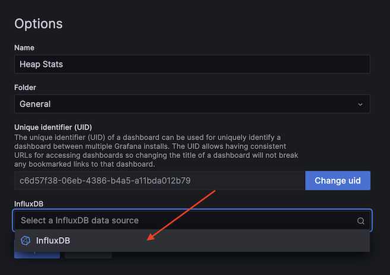

# `graphql-engine` Profiling Demo

**NOTE:** This repository contains important submodules. Either clone with the
`--recursive` flag or do `git submodule init && git submodule update` after
cloning.

<hr>

A demo of profiling Hasura's `graphql-engine` using
[`ghc-eventlog-socket`](https://github.com/bgamari/ghc-eventlog-socket) and
[`eventlog-live`](https://github.com/mpickering/eventlog-live). Components:
- A [`graphql-engine`](https://github.com/hasura/graphql-engine) executable that
  has been instrumented using
  [`ghc-eventlog-socket`](https://github.com/bgamari/ghc-eventlog-socket) to
  stream its eventlog over a socket during execution.
- Another executable (in
  [./engine/eventlog-influxdb](./engine/eventlog-influxdb/)) which reads data
  from the eventlog socket and inserts it into an
  [InfluxDB](https://github.com/influxdata/influxdb) database.
- A benchmarking tool (in [./bench](./bench)) copied from the existing
  `graphql-engine` benchmark suite to generate traffic and make the profile more
  interesting.
- A [Grafana](https://github.com/grafana/grafana) instance to view the live
  eventlog data on a pretty webpage.
- A [Docker Compose](https://docs.docker.com/compose/) configuration to tie all
  of this together and run it all with a single command.

## Usage

### Build the images

> **NOTE:** There are `linux/amd64` and `linux/arm64` images published on Docker
> Hub which are already listed in the `docker-compose.yml`, so building the
> images yourself is only necessary if the pre-built images are not acceptable
> for some reason.

Begin by building the base benchmarking image:
```bash
docker build ./bench/graphql-bench/app -t "<benchmarking base image tag>"
```

Next, change the `FROM` clause in `./bench/Dockerfile` to match the
`<benchmarking base image tag>` from above, then build the benchmarking image:
```bash
docker build ./bench -t "<benchmarking image tag>"
```

Now build the base `graphql-engine` image:
```bash
docker build ./engine -f ./engine/base.Dockerfile -t "<graphql-engine base image tag>"
```

Now change the `FROM` clause in `./engine/main.Dockerfile` to match the
`<graphql-engine base image tag>` from above, then build the `graphql-engine`
image:
```bash
docker build ./engine -f ./engine/main.Dockerfile -t "<graphql-engine image tag>"
```

With the images built, replace `finleymcilwaine/graphql-bench:main` with
`<benchmarking image tag>` and `finleymcilwaine/graphql-engine:main` with
`<graphql-engine image tag>` in `./docker-compose.yml`. The steps below should
now work for you.

### Start the containers

Run everything with just:
```
docker compose up
```

If it's your first time pulling the images, it may take a while (the
`graphql-engine` image is about 1GB in compressed size).

The benchmark will just run on a loop. There will be a lot of docker compose log
output from the the PostgreSQL and `graphql-engine` instances as they handle the
requests from the benchmark.

### Viewing the data

Navigate to [`localhost:3000`](http://localhost:3000) for the Grafana instance.
Enter username `admin` and password `admin`.

The InfluxDB instance is preconfigured as a data source in the Grafana
container, so all you have to do is create a dashboard which visualizes the
eventlog data from the InfluxDB instance. You can either create your own, or
import one of the preexisting ones from the
[`./grafana/dashboards`](./grafana/dashboards/) folder in this repository.

#### Importing a dashboard

Under the "Dashboards" tab in the side navigation bar, select "Import":


Select the "Upload dashboard JSON file" option and upload one of the dashboard
files in the [`./grafana/dashboards`](./grafana/dashboards/) folder. When
prompted to select the InfluxDB data source, select the preconfigured one:

